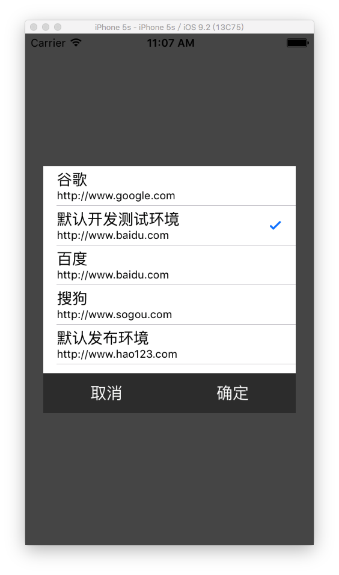

# SYNetworkEnvironment
网络环境设置（可设置多个网络环境），便于开发

# 网络环境配置的framework使用
 * 1、导入 SYNetworkEnvironment.framework 文件
 * 2、导入 SYNetworkEnvironment.plist 文件，并设置参数，如：
  * 参数1、键：keyNetworkEnvironment，值：开发测试环境0，或发布环境1
  * 参数2、键：keyNetworkEnvironmentPublic，值：发布环境服务器地址
  * 参数3、键：keyNetworkEnvironmentDevelop，值：开发测试环境服务器地址
  * 参数4、键：keyNetworkEnvironmentOhter，值：其他开发测试环境字典（键值对，其中键为名称，值为服务器地址）
 * 3、导入头文件，如：
#import "SYNetwrokEnvironment.framework/Headers/SYNetworkEnvironment.h"
 * 4、初始化网络环境，即在方法"- (BOOL)application:(UIApplication *)application didFinishLaunchingWithOptions:(NSDictionary *)launchOptions{}"中进行初始化。如：
~~~javascript
- (BOOL)application:(UIApplication *)application didFinishLaunchingWithOptions:(NSDictionary *)launchOptions
{
    // Override point for customization after application launch.

    [NetworkEnvironment initializeNetworkEnvironment];

    return YES;
}
~~~
 * 5、使用
  * （1）添加到视图控制器，便于显示交互视图。如果网络环境的keyNetworkEnvironment值为1，则在对应视图控制器的导航栏右按钮位置显示交互按钮；如果值为0，则不显示，但可以在对应视图控制器的导航栏右按钮位置通过连续点击5次显示交互选择视图。
~~~javascript
// 退出，或不退出APP
[NetworkEnvironment networkButtonWithNavigation:self exitApp:NO settingComplete:^{
    // UIWindow *window = [[UIApplication sharedApplication].delegate window];
    // window.rootViewController = [UIApplication sharedApplication].delegate

    AppDelegate *appDelegate = ((AppDelegate *)[UIApplication sharedApplication].delegate);
    [appDelegate initRootViewController];
}];
~~~
  * （2）获取定义的网络环境，如：
~~~javascript
NSLog(@"当前网络环境地址：%@", networkHost);
~~~

 * 6、注意事项
  * （1）plist文件的设置
   * a）名称：SYNetworkEnvironment.plist
   * b）网络环境的键名称：keyNetworkEnvironment
   * c）网络环境的键对应的值：0为测试开发环境、1为发布环境
   * d）网络环境发布环境的键名称：keyNetworkEnvironmentPublic
   * e）网络环境的测试开发环境的键名称：keyNetworkEnvironmentDevelop
   * f）网络环境的其他自定义环境的键名称：keyNetworkEnvironmentOhter
   * g）网络环境的其他自定义环境的键对应的值为字典类型，其他的键对应的值均为字符串类型
  * （2）网络环境设置的交互视图显示在用户自定义的视图控制器中
* SYNetworkEnvironment.plist 文件配置

 * 使用效果图

 * 选择网络环境前

 * 选择网络环境

 * 选择网络环境后

