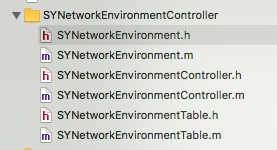
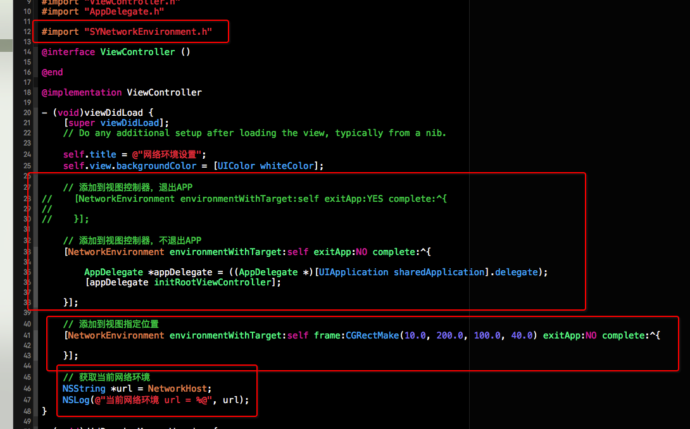
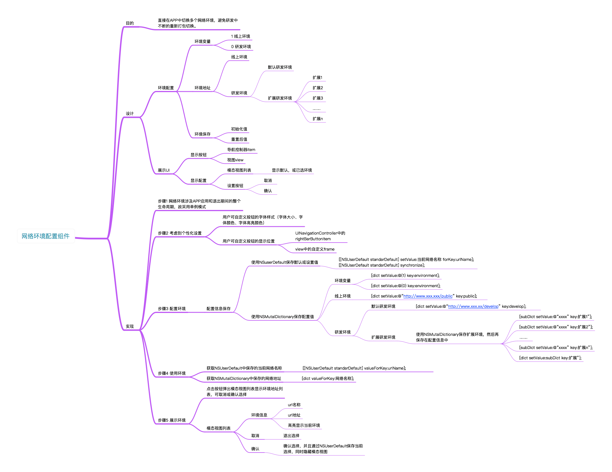

# SYNetworkEnvironment
网络环境设置（可设置多个网络环境），便于开发。避免切换不同的环境进行测试时，不断地重新进打包安装包文件。

 * 使用效果图


# 网络环境配置组件的使用
 * 1、导入 SYNetworkEnvironment 相关类文件
 * 2、导入头文件，如：
~~~ javascript
#import "SYNetworkEnvironment.h"
~~~ 
 * 3、初始化网络环境，即在方法"- (BOOL)application:(UIApplication *)application didFinishLaunchingWithOptions:(NSDictionary *)launchOptions{}"中进行初始化。如：
~~~ javascript
- (BOOL)application:(UIApplication *)application didFinishLaunchingWithOptions:(NSDictionary *)launchOptions
{
    // Override point for customization after application launch.

    // 环境设置
    NetworkEnvironment.environmentHost = @"0";
    NetworkEnvironment.environmentHostDebug = @"http://www.hao123.com";
    NetworkEnvironment.environmentHostRelease = @"http://www.baidu.com";
    NetworkEnvironment.environmentHostDebugDict = @{@"天猫":@"http://www.tiaomiao.com",@"淘宝":@"http://www.taobao.com",@"京东":@"http://www.jindong.com"};
    // 初始化
    [NetworkEnvironment initializeEnvironment];

    return YES;
}
~~~
 * 4、使用
  * （1）添加到视图控制器，便于显示交互视图。如果网络环境的keyNetworkEnvironment值为1，则在对应视图控制器的导航栏右按钮位置显示交互按钮；如果值为0，则不显示，但可以在对应视图控制器的导航栏右按钮位置通过连续点击5次显示交互选择视图。
~~~ javascript
// 退出，或不退出APP
[NetworkEnvironment environmentWithTarget:self exitApp:NO complete:^{

}];
~~~
  * （2）添加到指定视图的指定位置
~~~ javascript
[NetworkEnvironment environmentWithTarget:self frame:CGRectMake(10.0, 200.0, 100.0, 40.0) exitApp:NO complete:^{

}];
~~~
  * （3）获取定义的网络环境，如：
~~~ javascript
NSString *url = NetworkHost;
NSLog(@"url = %@", url);
~~~

 * 5、注意事项
  * （1）网络环境初始化
   * a）开发环境，还是线上环境
   * b）环境地址
   * c）初始化initializeEnvironment
  * （2）网络环境设置的交互视图显示在用户自定义的视图控制器中，或在视图中


# 配置图
## 导入资源组件


## 导入头文件及配置初始化


## 使用



# 设计原理




# 修改完善
* 20180117
  * 版本号：1.2.1
  * 环境属性修改

```
/// 网络环境（0为测试环境；1为线上环境）
@property (nonatomic, strong) NSString *environmentHost;
```

* 20171024
  * 版本号：1.2.0
  * 添加手动配置地址功能

* 20170708
  * 版本号：1.0.1
  * 修改成present Controller的样式

* 20170422
  * 版本号：1.0.1
  * SYNetworkEnvironment修复bug

* 20170414
  * 版本号：1.0.0
  * 功能修改：
    * 修改环境依赖，剔除plist文件；
    * 修改样式属性统一title开头；


